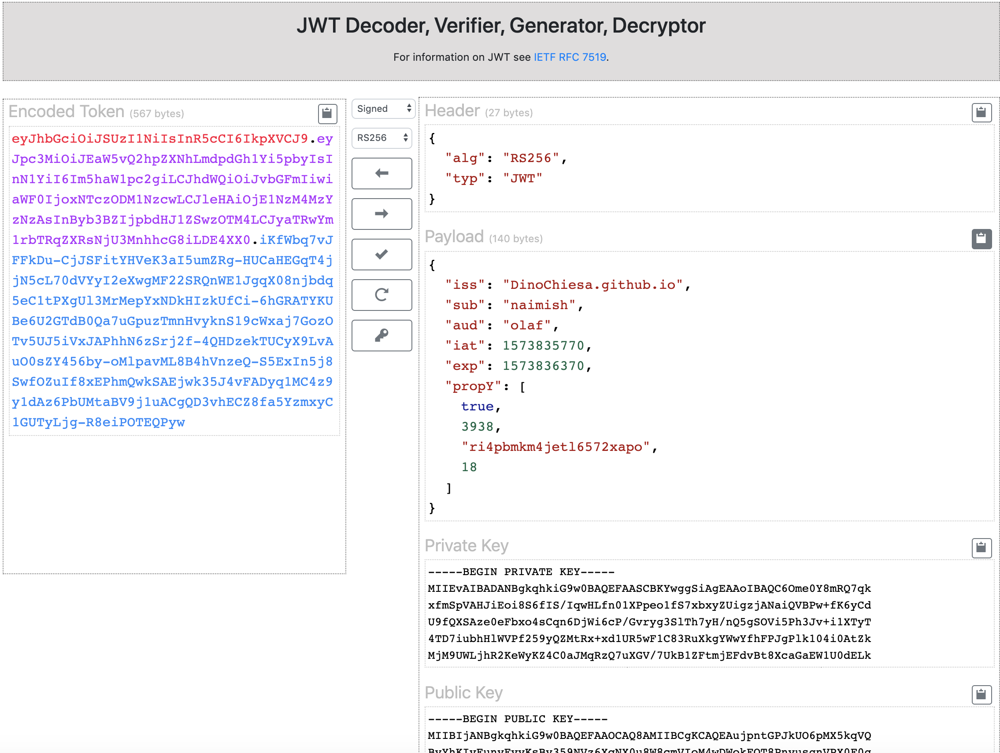

# HTTP Signature Web tool

This is the source code for a web tool that can generate HTTP Signatures.
It has some limitations!



## License

This code is Copyright (c) 2020 Google LLC, and is released under the Apache
Source License v2.0. For information see the [LICENSE](LICENSE) file.

## Purpose

I built this as a tool that might be helpful to developers learning HTTP Signature, or
experimenting with HTTP Signature.  The output of this repo is currently
running [here](https://dinochiesa.github.io/httpsig/).

## Disclaimer

This tool is not an official Google product, nor is it part of an official
Google product.

## Limitations

This tool has some limitations:
 - algorithms: rsa-sha256, hmac-sha256, hs2019 (either hmac or rsa)

 - This tool uses EcmaScript v9, and webcrypto, which means it will run only on
   modern, current browsers.

## Design

This is a single-page web app. It has no "backend" supporting it. All
signing and verifying happens within the browser.
Anything a user pastes into the UI never leaves the browser. It just needs a few
static files.

## Dependencies

The web app depends on
* [jQuery](https://jquery.com/) - for interactivity
* [Bootstrap 4.0](https://getbootstrap.com/) - for UI and styling
* [node-jose](https://github.com/cisco/node-jose) - for PBKDF2
* [webcrypto](https://developer.mozilla.org/en-US/docs/Web/API/Web_Crypto_API) - for generating RSA and ECDSA keys


## Build Dependencies

This tool uses [webpack v4](https://webpack.js.org/) for bundling the assets.

## Please send pull requests

I'm always looking for constructive feedback.

## Developing

If you fork this repo to mess with the code, here's what I advise.

To build a "development" distribution:

```
npm run devbuild
```

During development, I prefer to use the webpack "watch" capability, which
rebuilds as I modify the source code. For that, open a Chrome browser tab to
file:///path/to/dist/index.html .  Then in a terminal,

```
npm run watch
```

The above command will run "forever", and will rebundle when any source file
changes. When you save a file, wait a few seconds for the build, maybe 5
seconds, and then just click the reload button in the browser tab, to see the
updates.


To build a production distribution:

```
npm run build
```

## Bugs

* ??

